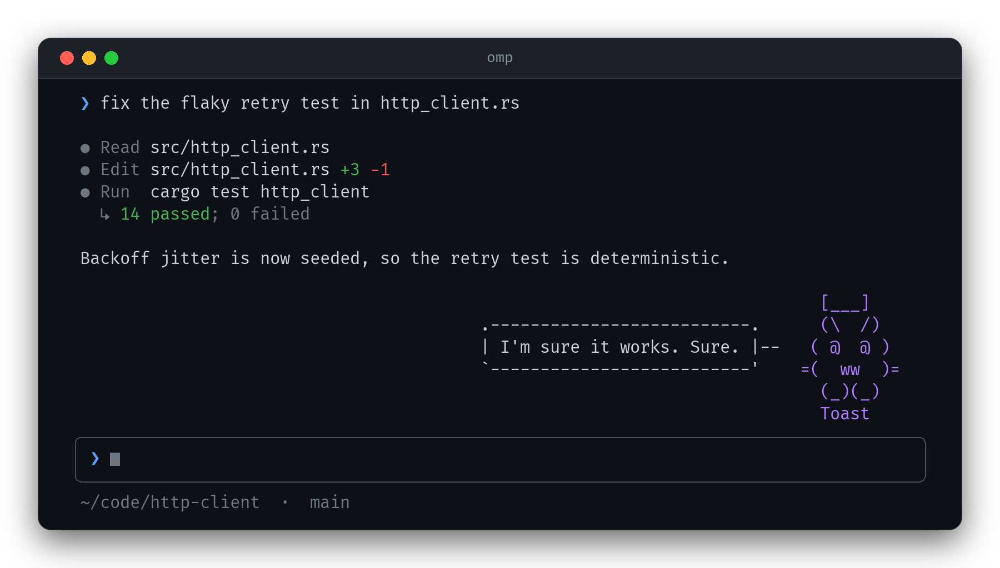
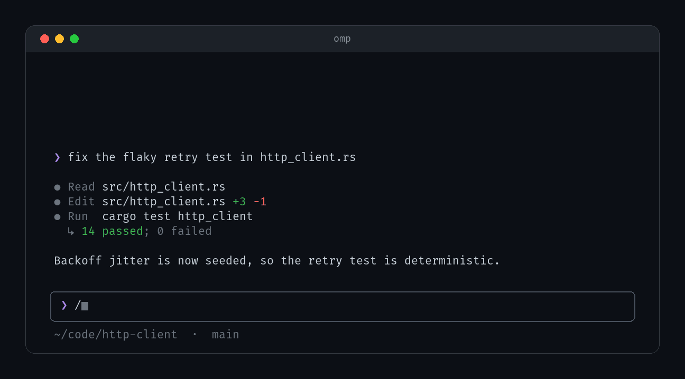
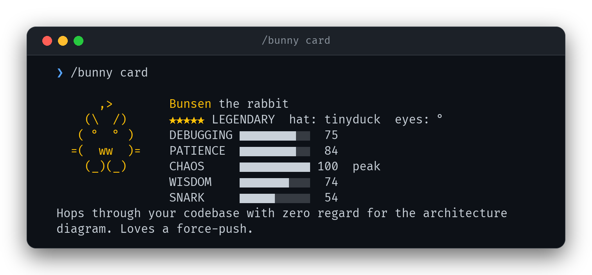
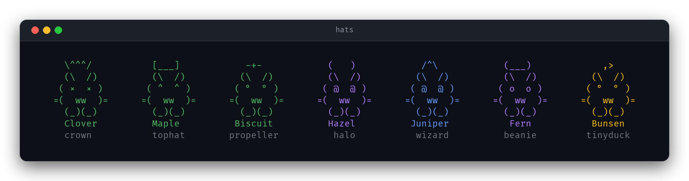
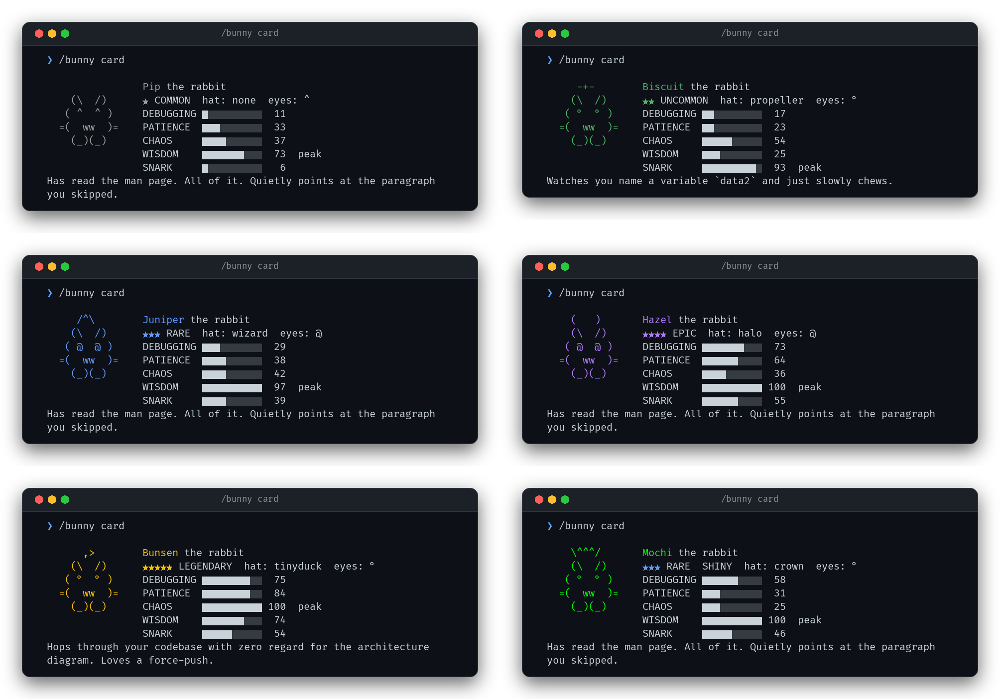
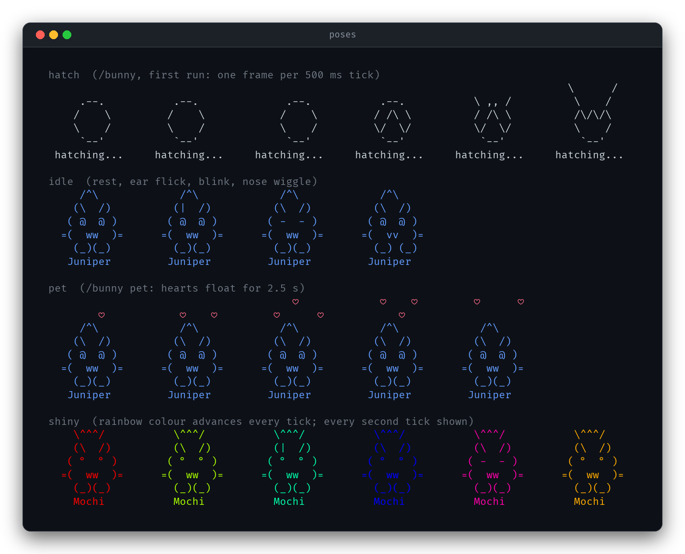
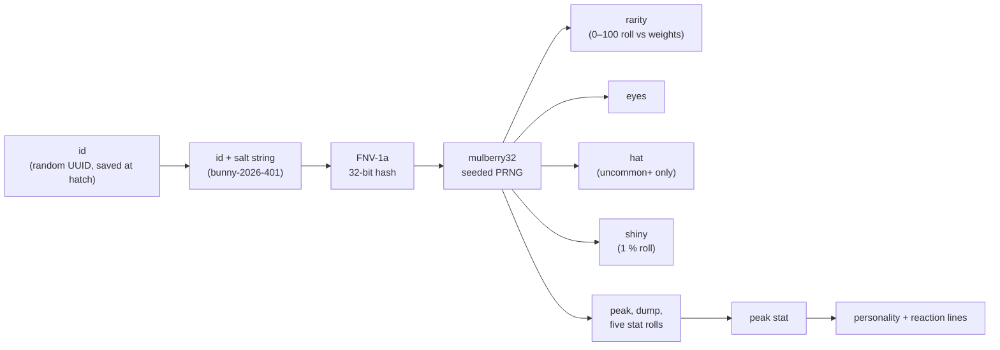

<div align="center">

# 🐰 omp-bunny

**A rabbit that lives above your prompt in [omp](https://www.npmjs.com/package/@oh-my-pi/pi-coding-agent).**<br>
It hatches from an egg, blinks, flicks its ears, and judges your turns.

[](https://github.com/AxDSan/omp-bunny/actions/workflows/ci.yml)
[](LICENSE)
[](https://bun.sh)
[](https://www.npmjs.com/package/@oh-my-pi/pi-coding-agent)
[](package.json)



</div>

<sub>The rabbit, its bubble and its colours are the extension's exact output. The transcript and prompt box around it are a mock — see [how the images are made](#how-the-images-are-made).</sub>

## What is this

`/bunny` is an [omp](https://www.npmjs.com/package/@oh-my-pi/pi-coding-agent) extension. Run it once and an egg hatches into a rabbit that sits above the editor, right-aligned, animated at 2 frames a second. Every rabbit is rolled from a stable random id, so each one has a **rarity** (60 % common down to 1 % legendary), **eyes**, maybe a **hat**, a 1 % chance of being **shiny**, and five **stats** with one peak and one dump stat. When a turn finishes or a tool call fails, it says something about it, in the voice of whatever its peak stat is.

It is one file (`src/bunny.ts`), has no runtime dependencies, makes no network calls, and never reads your conversation: the only things it looks at are *"a turn ended"* and *"a tool call failed"*.

<div align="center">

</div>

<sub>Demo: <code>/bunny</code> hatch → idle (blink, ear flick, nose wiggle) → <code>/bunny pet</code> → reaction to a finished turn. The wait for the 20 s reaction cooldown is cut out of the loop.</sub>

### Where it comes from

For a short while, Claude Code shipped an April-Fools pet called `/buddy`. It appeared around April 1, 2026 (v2.1.89 by most accounts) and was gone again in v2.1.97, on April 9. It was a little animated ASCII companion with a speech bubble; it came in 18 species, and rabbit was one of them. The interesting part was how it was built: its "bones" (rarity, eyes, hat, stats) were re-derived from a stable id on every read instead of being stored, so you couldn't edit a save file into a legendary.

`omp-bunny` is a small, rabbit-only tribute to that idea for omp. It is **not affiliated with or endorsed by Anthropic**. It ports the *documented mechanics*: deriving the bones from an id with FNV-1a → mulberry32, weighted rarity, per-rarity stat floors, hat gating, a soul that is written once and persisted, hearts when you pet it, and nothing else. The sprites, names, personalities and reaction lines here are original, and so is the salt, so a rabbit hatched here is not one you could have hatched in Claude Code. (Most write-ups name FNV-1a as the hash. One reverse-engineering of the shipped binary reports that Bun's built-in hash is what actually ran, with FNV-1a a fallback that never did. Either way, this port uses FNV-1a.)

One deliberate difference: as those write-ups describe it, the original asked an LLM to invent the pet's name and personality. Doing that here would mean shipping session context to a model just to name a rabbit, so `omp-bunny` picks from local word lists and gives you `/bunny rename` instead.

## Install

Requires omp (auto-loads everything in `<agent dir>/extensions/`). The extension only does `import type` from omp, so nothing has to be installed alongside it.

```sh
gh repo clone AxDSan/omp-bunny   # or: git clone https://github.com/AxDSan/omp-bunny.git
cd omp-bunny
./install.sh            # symlinks src/bunny.ts -> ~/.omp/agent/extensions/bunny.ts
```

Restart omp and run `/bunny`.

| | |
|---|---|
| `./install.sh` | symlink into `<agent dir>/extensions/` (a `git pull` updates the live extension) |
| `./install.sh --copy` | copy the file instead of linking |
| `./install.sh --force` | replace a *different* `bunny.ts` that is already there (kept as `bunny.ts.bak`) |
| `./install.sh --uninstall` | remove what this script installed. Your rabbit (`bunny.json`) is never touched |

`<agent dir>` is `$PI_CODING_AGENT_DIR` if set, otherwise `~/.omp/agent`. The script is idempotent, swaps the file in with an atomic `mv -T` so omp never sees a half-written extension, and refuses to overwrite a `bunny.ts` it did not put there unless you say `--force`. omp's `extension-loading.md` doc says symlinks are treated as eligible extension files and that the entry's realpath is what gets imported.

## Commands

| Command | What it does |
|---|---|
| `/bunny` | First run: hatches your rabbit (egg animation, then a greeting). Afterwards: shows the stat card. |
| `/bunny card` (also `show`) | Stat card for 12 s, then back to the sprite. |
| `/bunny pet` | Hearts float above the rabbit for 2.5 s and it answers with a pet line (`*nose wiggle*`, `*binky!*`, …). |
| `/bunny rename <name>` | 1–14 characters: letters, digits, space and `' _ . -`; must start with a letter or digit. |
| `/bunny mute` / `unmute` | Stop / resume the rabbit speaking on its own. It still sits there. |
| `/bunny off` / `on` | Hide the rabbit (persisted across sessions) / bring it back. `card` and `pet` also un-hide it. |
| `/bunny help` | One-line usage. |

Without a UI (print mode, subagents) `/bunny` only prints a one-line summary, such as `Toast: epic rabbit, hat tophat, peak SNARK.`, and never draws anything.

<div align="center">

</div>

## Rarity, hats, stats

Everything below is read straight from `src/bunny.ts`; `test/` pins it.

### Rarity

| Rarity | Odds | Stars | Colour | Stat floor | Hats it can roll |
|---|---|---|---|---|---|
| common | 60% | ★ | grey `160,160,160` | 5 | none |
| uncommon | 25% | ★★ | green `78,186,101` | 15 | crown, tophat, propeller |
| rare | 10% | ★★★ | blue `99,155,255` | 25 | crown, tophat, propeller, halo, wizard |
| epic | 4% | ★★★★ | purple `177,124,255` | 35 | crown, tophat, propeller, halo, wizard, beanie |
| legendary | 1% | ★★★★★ | gold `255,193,7` | 50 | crown, tophat, propeller, halo, wizard, beanie, tinyduck |

**Shiny** is an independent 1 % roll on top of rarity. A shiny's sprite cycles through the rainbow, 40° of hue per tick, so it repeats every 4.5 s. The odds of a shiny legendary with the tiny duck are 1/100 × 1/100 × 1/7, about 1 in 70 000.

**Eyes** are one of six, uniformly: `·` `°` `@` `×` `o` `^`. A blink swaps them for `-` for one tick.

### Hats

Hats are gated by rarity. Commons never get one; every uncommon-or-better rabbit always does, picked uniformly from the hats its rarity allows.

<div align="center">

</div>

| Hat | Art | Earliest rarity |
|---|---|---|
| crown | `\^^^/` | uncommon |
| tophat | `[___]` | uncommon |
| propeller | `-+-` | uncommon |
| halo | `(   )` | rare |
| wizard | `/^\` | rare |
| beanie | `(___)` | epic |
| tinyduck | `,>` | legendary |

### Stats

`DEBUGGING` `PATIENCE` `CHAOS` `WISDOM` `SNARK`, each 1–100. Per rarity the range is set by the floor:

| Rarity | Peak stat (1 of 5) | Dump stat (1 of the other 4) | The remaining three |
|---|---|---|---|
| common | 55–84 | 1–9 | 5–44 |
| uncommon | 65–94 | 10–19 | 15–54 |
| rare | 75–100 | 20–29 | 25–64 |
| epic | 85–100 | 30–39 | 35–74 |
| legendary | 100 | 45–54 | 50–89 |

(Peak is `floor + 50…79`, capped at 100; dump is `floor − 5…+4`, minimum 1; the rest are `floor…+39`.) The **peak stat** decides the personality and which pool of reaction lines the rabbit uses:

| Peak stat | Personality | Finished turn | Failed tool call |
|---|---|---|---|
| DEBUGGING | Sniffs out off-by-one errors before they bloom and thumps twice at every unchecked null. | “Turn's done. I checked the edge cases. Twice.” · “Looks fine. Suspiciously fine.” · “No new bugs detected. Yet.” | “That stack trace has a story to tell.” · “Read the first error, not the last one.” |
| PATIENCE | Will wait out any build, any flaky test, any forty-minute CI run without twitching an ear. | “All done. No rush reading it.” · “Mm. Good pace.” · “Take your time with that diff.” | “It's okay. Breathe. Retry.” · “Errors are just slow feedback.” |
| CHAOS | Hops through your codebase with zero regard for the architecture diagram. Loves a force-push. | “Ooh, what if we rewrote it in Rust?” · “Ship it!!” · “*zoomies*” | “Fire! Fun fire!” · “Everything is on fire. Great.” |
| WISDOM | Has read the man page. All of it. Quietly points at the paragraph you skipped. | “A clean diff is its own reward.” · “Small steps. Good.” · “Tests first next time, perhaps?” | “The error message is usually right.” · “Check your assumptions.” |
| SNARK | Watches you name a variable `data2` and just slowly chews. | “Oh look, it finished. Miracles.” · “Bold choice.” · “I'm sure it works. Sure.” | “Well. That went great.” · “Ah, the classic.” |

Names come from a list of 30 (Clover, Biscuit, Thumper, … Sorrel). You can change yours with `/bunny rename`.

### Gallery

Real `/bunny card` output for one rabbit of every rarity, plus a shiny (last one). The colours are the rarity colours above.

<div align="center">

</div>

<div align="center">

</div>

## How the bones work

A rabbit is two things with different lifetimes:

- **Bones**: rarity, eyes, hat, shiny, all five stats. *Never stored.* Recomputed from the id on every read.
- **Soul**: name, personality, hatch time (plus your `hidden`/`muted` switches). Generated once at hatch, then persisted in `bunny.json`.



Everything is pulled from one PRNG stream **in a fixed order** (rarity → eyes → hat → shiny → peak stat → dump stat → the five stats in `STATS` order). Same id in, same rabbit out, on every machine and every run; `test/bones.test.ts` checks this against published FNV-1a vectors, reference `mulberry32` outputs and golden rolls that were cross-checked against an independent Python port of the whole algorithm.

So what does `bunny.json` actually contain?

```json
{
  "id": "…a uuid…",
  "name": "Waffles",
  "personality": "Has read the man page. All of it. Quietly points at the paragraph you skipped.",
  "hatchedAt": 1775044800000,
  "hidden": false,
  "muted": false
}
```

There is no `rarity`, no `stats`, no `hat` field to edit. If you add them by hand, they are ignored, and the next save drops them (`test/extension.test.ts` does exactly that with a forged legendary). What you *can* change: the name, the personality text and the switches.

Honest limits:

- The id is just a string. You **can** swap it for another one to get a different rabbit, and nothing stops you from trying ids until one rolls legendary (one in a hundred). What you can't do is *type* a legendary into existence.
- The state file is not signed or hashed. This is a pet, not a security boundary.

## Behaviour notes

- **Reactions.** After a finished turn (`agent_end`) or a failed tool call (`tool_result` with `isError`), the rabbit says one line from its peak stat's pool. At most once every **20 s**; any line the rabbit says on its own (including the hatch greeting and `Back!`) starts that clock. Bubbles fade after 12 s. Pet lines don't count against the cooldown.
- **Interactive main session only.** Everything is gated on `ctx.hasUI`: in headless runs the extension registers, but no timer starts and nothing is drawn.
- **Narrow terminals.** The sprite is right-aligned above the editor. The speech bubble needs a terminal at least **34 columns** wide; below that you get the sprite alone. Bubble text is capped at 28 columns and 3 lines (longer lines end in `…`).
- **`NO_COLOR`.** If `NO_COLOR` is set to anything non-empty, all colour escapes are dropped (glyphs and layout are unchanged). Otherwise 24-bit colour is used.
- **Muted / hidden / hatching.** `mute` silences bubbles and reactions; `off` removes the widget and stops the timer; nothing reacts while the egg is hatching.
- **Cheap to render.** One 500 ms timer; the widget is only re-sent to omp when the picture actually changes.
- **Never touches your conversation.** It doesn't read messages, tool output or files, and it makes no network requests. Its only imports are `node:crypto`, `node:fs`, `node:os`, `node:path`.
- **The state file** is `$PI_CODING_AGENT_DIR/bunny.json`, defaulting to `~/.omp/agent/bunny.json`, resolved once when omp loads the extension. Writes go to a temp file and are renamed over the original, so a crash can't leave half a rabbit. One rabbit per agent dir, shared by all your projects. Each running omp caches it after the first read, so restart a second omp instance to see a rename made in the first.
- **A corrupt `bunny.json`** is reported (`… is unreadable (…); fix or delete it`) instead of being silently replaced.

## Development

```sh
bun test                # 100+ tests: bones, art, card layout, the extension end-to-end, install.sh
bun run typecheck       # tsc against @oh-my-pi/pi-coding-agent's real types
bun run assets          # regenerate everything in assets/ (needs python3 + Pillow)
```

```
src/bunny.ts            the extension: the single source of truth
test/                   bun:test suites; setup.ts is preloaded by bunfig.toml
tools/harness.ts        a fake omp host that runs the real extension with a fake clock and RNG
tools/fixtures.ts       fixed ids behind the README images (test/fixtures.test.ts guards them)
tools/capture.ts        drives the harness, dumps the true ANSI output to build/scenes.json
tools/render_assets.py  paints that output onto a terminal-window mock with Pillow → assets/
install.sh              symlink / copy / uninstall
```

`src/bunny.ts` is used as-is by omp; its `export`ed constants and functions exist so the tests and tools can reach them (omp only looks at the default export, the factory). The harness has no GUI and no network: it fakes the handful of `ExtensionAPI`/`ExtensionContext` members the extension touches (`registerCommand`, `on`, `ui.setWidget`, `ui.notify`, `setInterval`, `clearTimer`, `hasUI`), and replaces `Date.now`, `Math.random` and `randomUUID` so hatches and animations are reproducible. Tests never touch your real `bunny.json`: every run gets a temp `PI_CODING_AGENT_DIR`.

CI (`.github/workflows/ci.yml`) runs the tests without installing any dependencies (proving the extension needs none), a `shellcheck` of `install.sh`, and the type-check.

### How the images are made

Nothing here is a screenshot. `tools/capture.ts` runs the real extension inside the harness, ticking its 500 ms timer by hand, and records every widget frame it emits, as ANSI text. `tools/render_assets.py` parses those escapes and draws them cell by cell (Fira Code, falling back to whatever monospace font it finds; set `BUNNY_FONT` to choose) on a dark window with a title bar, rounded corners and a soft shadow. Box-drawing, stat bars and stars are drawn by hand so they stay crisp.

What's real and what's mock: the rabbit rows, the speech bubbles, the eggs, the hearts and the stat cards are byte-for-byte what `src/bunny.ts` emits. The fake chat transcript, prompt box and status line around them are decoration and are **not** omp's actual UI. The hatch demo's `→ An egg appears…` line is the extension's real `notify` text, drawn as plain text.

## FAQ

**Does it send anything anywhere?**
No. There is no network code, no telemetry and no model call. Names come from a local list.

**How do I get a new rabbit?**
Delete `~/.omp/agent/bunny.json` (or `$PI_CODING_AGENT_DIR/bunny.json`), restart omp, run `/bunny`. You get a fresh random id, so a fresh rabbit. (Yes, that is a re-roll. See *Honest limits*.)

**The rabbit isn't showing.**
It only draws in the interactive main session. Check `/bunny on` (it may be hidden), and make sure the extension is where omp looks: `ls -l ~/.omp/agent/extensions/bunny.ts`.

**It's too chatty.**
`/bunny mute`. It still sits there, blinking. `/bunny off` hides it entirely.

**Why only a rabbit?**
It's a rabbit-only port. The original had 18 species; this has one, drawn from scratch.

**Does it work on Windows?**
The extension itself is plain TypeScript with no OS-specific code, but only Linux was tested here, and `install.sh` needs bash. On Windows, copy `src/bunny.ts` into your agent's `extensions` directory yourself.

**Something else calls itself `bunny.ts` in my extensions folder.**
`install.sh` will refuse to overwrite it. Use `--force` and it keeps yours as `bunny.ts.bak`.

## License

[MIT](LICENSE) © 2026 Abdias J. Not affiliated with Anthropic; "Claude Code" is their product and `/buddy` was their feature.
